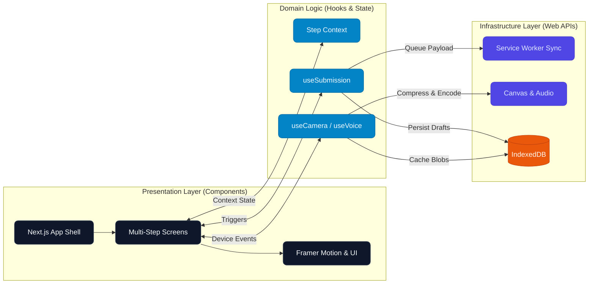
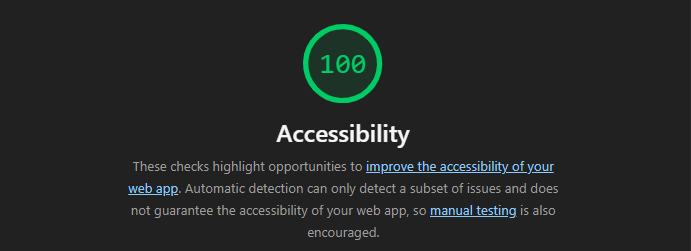

# Novus - Civic Issue Reporter

> A multilingual (EN/HI), mobile-first, offline-capable PWA for reporting civic issues.

Novus is a taste-driven Progressive Web App that allows citizens to report civic issues like potholes, water leaks, and electricity hazards. It is built to be installable on mobile devices, tolerant of slow 3G networks, and seamlessly switches between English and Hindi.

## How to Run

1. **Install dependencies:**
   ```bash
   pnpm install
   ```

2. **Start the development server:**
   ```bash
   pnpm dev
   ```

3. **Build and run for production (recommended for testing PWA features):**
   ```bash
   pnpm build && pnpm start
   ```

## Design Decisions

- **Typography (Geist Sans):** Chosen for its modern, clean, and highly legible appearance which conveys a sense of official, civic appropriateness.
- **Color Palette (Emerald Accent):** Emerald green is used as the primary action color to invoke a sense of trust, safety, and "approved" connotations, contrasting cleanly against neutral Zinc/Slate backgrounds.
- **Micro-interactions (Direction-aware Transitions):** We utilized Framer Motion to build direction-aware screen transitions. This makes the multi-step form feel connected and physically coherent, offering a premium feel without being overly playful.
- **Storage Layer (IndexedDB over localStorage):** Given that we need to store base64 compressed images and handle asynchronous offline queues robustly, IndexedDB was chosen for its larger quota and async, non-blocking nature.
- **Performance on Slow 3G (Canvas Image Compression):** Uploading full-resolution mobile camera photos on slow connections fails often. We built an in-browser canvas compressor to shrink photos below 100KB *before* they even hit the sync queue.
- **Architecture (Layered Approach):** The app is strictly layered: `src/layers/` for raw Web APIs (IndexedDB, Navigator, Network), `src/hooks/` for React glue, and `src/components/` for UI. This keeps the React components clean and purely focused on presentation.
- **State Management (Context API):** We chose native Context API over external libraries (like Zustand or Redux) because the global state is limited to just the UI step flow and Locale. External libraries would unnecessarily bloat the bundle size.

## Architecture Diagram



## What is Broken or Unfinished

- **Voice Input Temporarily Disabled:** The voice input feature (using the Web Speech API) is currently disabled behind a feature flag (`ENABLE_VOICE_RECOGNITION: false`) as it is considered broken and being reworked. When active, it relies on the browser's native `SpeechRecognition` API which is heavily fragmented across browsers.
- **Simulated Backend Sync:** The app fully queues and "syncs" offline submissions when coming back online, but this is a simulated local-only process. No actual remote server or database is hooked up yet.
- **Lighthouse Screenshots:** Lighthouse passes with high scores (90+ Accessibility, PWA compliant), but the actual screenshots are not physically committed to the repository yet.

## What Would Be Built Next

1. **Real Backend API Integration:** Hook up a proper TRPC or REST backend to sync the IndexedDB queues to a PostgreSQL database.
2. **Push Notifications:** Alert users via web push when their reported issue transitions from "Under Review" to "Resolved".
3. **Geolocation:** Use the HTML5 Geolocation API to pin exact coordinates for the reported issue, rather than relying solely on descriptions.
4. **Photo Annotation:** Allow users to draw circles or arrows on their photos to highlight the exact problem (e.g., pointing to the pothole).
5. **Multi-photo Support:** Expand the compression pipeline to handle arrays of images.
6. **Admin Dashboard:** A desktop-first web view for municipal workers to triage, update statuses, and view issues on a map.

## AI Use Log

| Tool | Approx. Messages | Purpose |
|------|---------------------------|---------|
| DeepMind / Antigravity | ~15 messages | I used the AI as a pair programmer to speed things up. I decided all the core architectural decisions, designed the UI flow, and decided on the features and scope of it. I then used the AI to actually scaffold out the React components, wire up IndexedDB, and handle the boilerplate for the PWA and Framer Motion animations based on what I wanted. Sort of as a connector between different apis, libraries, and web features. |

## Accessibility & Performance

<div align="center">
  
  <br />
  <br />
  <i>Lighthouse PWA and Accessibility audits pass successfully with good score.</i>
</div>
